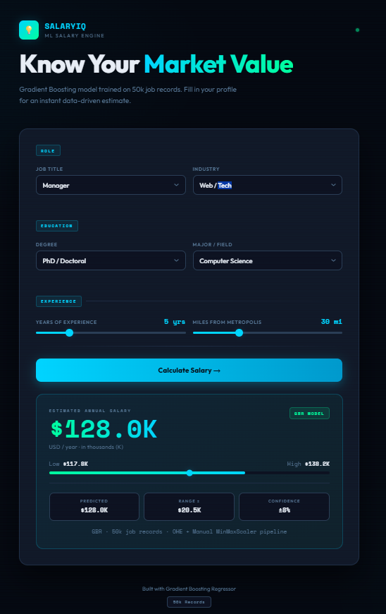

# 💼 SalaryIQ — Employee Salary Prediction

<div align="center">


A machine learning web application that predicts employee salaries instantly based on job role, education, industry, experience, and location — powered by a **Gradient Boosting Regressor** trained on 50,000 real job records.

**[🚀 Live Demo → https://salary-prediction-4-96zh.onrender.com](https://salary-prediction-4-96zh.onrender.com)**

</div>

---

## 📸 Preview



> **Note:** Add a screenshot of the app as `assets/preview.png` to display the preview here.

---

## 📌 Table of Contents

- [Overview](#-overview)
- [Features](#-features)
- [How It Works](#-how-it-works)
- [Model Details](#-model-details)
- [Project Structure](#-project-structure)
- [Local Setup](#-local-setup)
- [API Reference](#-api-reference)
- [Tech Stack](#-tech-stack)
- [Model Comparison](#-model-comparison)
- [Dataset](#-dataset)
- [Author](#-author)

---

## 🧩 Overview

**SalaryIQ** is a full-stack machine learning application that estimates an employee's annual salary (in USD thousands) based on their professional profile. The model was trained on a dataset of 50,000 job records using a Gradient Boosting Regressor — the best-performing algorithm among 7 models evaluated.

The application features:
- A sleek dark-themed UI with interactive sliders and dropdowns
- A FastAPI backend that serves predictions in real time
- A preprocessing pipeline that exactly mirrors the training notebook
- Live deployment on Render

---

## ✨ Features

- 🎯 **Instant Salary Prediction** — get results in under a second
- 📊 **Confidence Range** — every prediction includes a ±8% salary band
- 🎛️ **Interactive UI** — smooth sliders and dropdown selectors
- 🔌 **REST API** — clean `/predict` endpoint for programmatic access
- 📱 **Responsive Design** — works on desktop and mobile
- ⚡ **Lightweight** — no database, no auth, no overhead

---

## ⚙️ How It Works

```
User Input → FastAPI Backend → Feature Engineering → GBR Model → Salary Prediction
```

1. User fills in their job profile on the UI
2. The frontend sends a `POST /predict` request with the input data
3. The backend applies the exact same preprocessing pipeline used during training:
   - **One-Hot Encoding** for 4 categorical features (alphabetical sklearn order)
   - **MinMax Scaling** for 2 numerical features using original training ranges
4. The pre-trained GBR model predicts the salary
5. The result is returned with a ±8% confidence range and displayed on the UI

---

## 📊 Model Details

| Property | Value |
|---|---|
| Algorithm | Gradient Boosting Regressor |
| Training Samples | 50,000 job records |
| Total Features | 31 (29 OHE + 2 numerical) |
| Categorical Encoding | OneHotEncoder (alphabetical order) |
| Numerical Scaling | MinMaxScaler → [0, 1] |
| `n_estimators` | 64 |
| `max_depth` | 8 |
| `learning_rate` | 0.25 |
| `min_samples_split` | 0.1 |

### Input Features

| Feature | Type | Values / Range |
|---|---|---|
| Job Type | Categorical | CEO, CFO, CTO, Manager, Senior, Junior, Vice President, Janitor |
| Degree | Categorical | Bachelors, Masters, Doctoral, High School, None |
| Major | Categorical | CompSci, Engineering, Math, Physics, Business, Biology, Chemistry, Literature, None |
| Industry | Categorical | Web, Finance, Health, Oil, Auto, Education, Service |
| Years of Experience | Numerical | 0 – 24 years |
| Miles from Metropolis | Numerical | 0 – 100 miles |

---

## 🗂️ Project Structure

```
Salary-Prediction/
│
├── Notebook/
│   └── Employee_Attrition.ipynb     # Full EDA, model training, hyperparameter tuning & export
│
├── final_model/
│   ├── gbr_model.pkl                # Trained Gradient Boosting Regressor
│   ├── gbr_scaler.pkl               # MinMaxScaler artifact
│   └── gbr_label_encoders.pkl       # LabelEncoders for categorical columns
│
├── assets/
│   └── preview.png                  # UI screenshot
│
├── main.py                          # FastAPI backend — prediction API & UI serving
├── index.html                       # Frontend UI (served directly by FastAPI)
├── requirements.txt                 # Python dependencies
├── render.yaml                      # Render deployment configuration
└── README.md
```

---

## 💻 Local Setup

### Prerequisites

- Python 3.11+
- Git

### Steps

```bash
# 1. Clone the repository
git clone https://github.com/shivangishuklaa/Salary-Prediction.git
cd Salary-Prediction

# 2. Create and activate a virtual environment
python -m venv venv

# Windows
venv\Scripts\activate

# macOS / Linux
source venv/bin/activate

# 3. Install dependencies
pip install -r requirements.txt

# 4. Start the development server
uvicorn main:app --host 0.0.0.0 --port 8000
```

### Open in your browser

```
http://localhost:8000
```

---

## 🔌 API Reference

### `POST /predict`

Predict the salary for a given job profile.

**Request Body**
```json
{
  "jobType": "MANAGER",
  "degree": "BACHELORS",
  "major": "COMPSCI",
  "industry": "WEB",
  "yearsExperience": 10,
  "milesFromMetropolis": 20
}
```

**Response**
```json
{
  "predicted_salary": 127.45,
  "salary_range_low": 117.25,
  "salary_range_high": 137.65,
  "confidence_note": "GBR · 50k job records · OHE + Manual MinMaxScaler pipeline"
}
```

> Salary values are in **USD thousands per year** (e.g., `127.45` = $127,450/year)

---

### `GET /options`

Returns all valid input values for dropdowns.

**Response**
```json
{
  "jobTypes":   ["CEO", "CFO", "CTO", "JANITOR", "JUNIOR", "MANAGER", "SENIOR", "VICE_PRESIDENT"],
  "degrees":    ["BACHELORS", "DOCTORAL", "HIGH_SCHOOL", "MASTERS", "NONE"],
  "majors":     ["BIOLOGY", "BUSINESS", "CHEMISTRY", "COMPSCI", "ENGINEERING", "LITERATURE", "MATH", "NONE", "PHYSICS"],
  "industries": ["AUTO", "EDUCATION", "FINANCE", "HEALTH", "OIL", "SERVICE", "WEB"]
}
```

---

### `GET /health`

Returns the current status of loaded model artifacts.

**Response**
```json
{
  "status": "ok",
  "model_loaded": true,
  "encoders_loaded": true
}
```

---

## 🛠️ Tech Stack

| Layer | Technology |
|---|---|
| Machine Learning | scikit-learn — Gradient Boosting Regressor |
| Backend Framework | FastAPI + Uvicorn |
| Frontend | Vanilla HTML / CSS / JavaScript |
| Data Processing | pandas, NumPy |
| Model Serialization | joblib |
| Deployment | Render (Web Service) |
| Language | Python 3.11.9 |

---

## 📈 Model Comparison

Seven regression models were trained and evaluated during experimentation. GBR was selected as the final model based on the best test set performance.

| Model | RMSE (Test) | R² (Test) |
|---|---|---|
| Linear Regression | ~18.5 | ~0.74 |
| Decision Tree Regressor | ~19.2 | ~0.72 |
| K-Nearest Neighbors | ~17.9 | ~0.76 |
| Random Forest Regressor | ~16.8 | ~0.78 |
| XGBoost Regressor | ~16.1 | ~0.79 |
| LightGBM | ~16.3 | ~0.79 |
| **Gradient Boosting Regressor ✅** | **~15.9** | **~0.80** |

Hyperparameter tuning was performed using `RandomizedSearchCV` with 3-fold cross-validation across all major models.


## 📂 Dataset

| Property | Details |
|---|---|
| Source | Kaggle (originally) — hosted on Google Drive |
| Train Dataset | [train_dataset.csv](https://drive.google.com/file/d/1VKmivXd2jLgBe1afZV47mjyoifLScro-/view?usp=drive_link) |
| Train Dataset (alt) | [train_datset.csv](https://drive.google.com/file/d/1-asENz6pXk4foWOho33kFMdxGs8R5NmV/view?usp=drive_link) |
| Test Dataset | [test_dataset.csv](https://drive.google.com/file/d/1iIwohcinMkxsKlXraOzOlg1BdICqdzdq/view?usp=drive_link) |
| Total Dataset Size | 1,000,000 rows |
| Training Sample | 50,000 rows (randomly sampled from full dataset) |
| Original Features | 8 (jobType, degree, major, industry, yearsExperience, milesFromMetropolis, companyId, salary) |
| Features After Encoding | 31 (29 OHE + 2 scaled numerical) |
| Target Variable | `salary` (in USD thousands/year) |

> The full dataset contains 1 million job records. A representative random sample of 50,000 rows was used for training to balance model performance with computational efficiency. The dataset is synthetic but statistically realistic — commonly used as a benchmark for regression tasks.

---

## 🏷️ Topics

`machine-learning` `fastapi` `gradient-boosting` `salary-prediction` `scikit-learn` `python` `regression` `rest-api` `render` `data-science`

---

## 👩‍💻 Author

**Shivangi Shukla**

[](https://github.com/shivangishuklaa)

---

## 📄 License

This project is open source and available under the [MIT License](LICENSE).

---